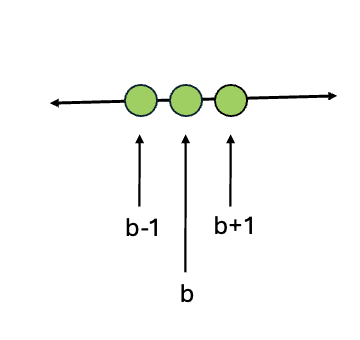
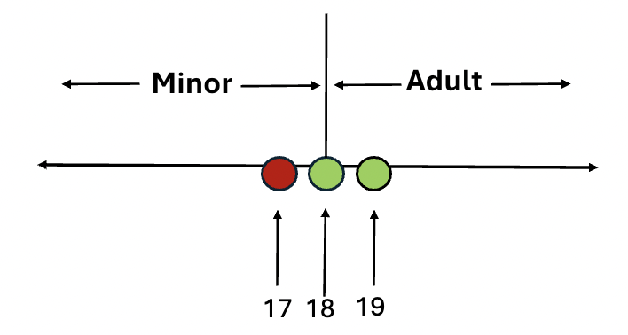
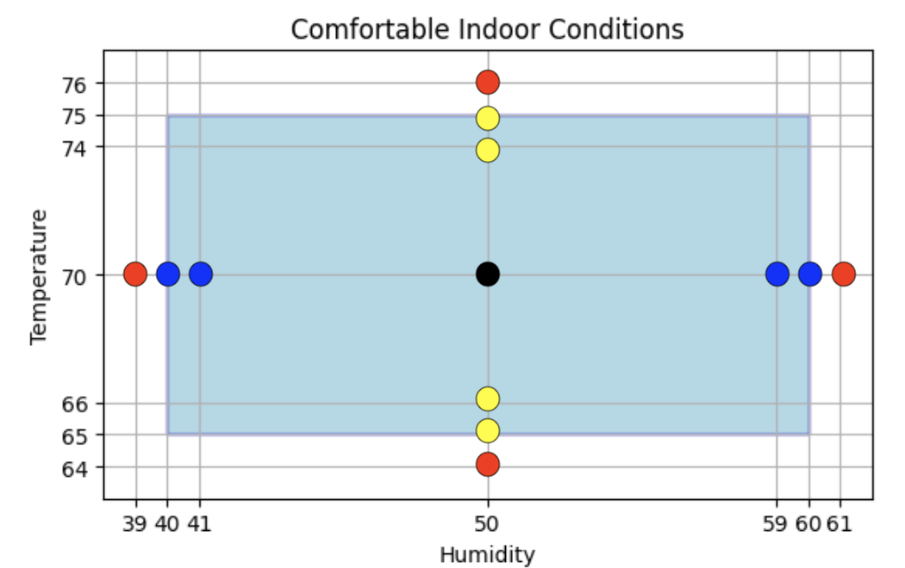

## Week 3 - Equivalence Partitioning and Boundary Value Analysis

Suppose a program reads in an integer and prints whether it is negative,
neutral, or positive. It is not feasible to test the program with every
possible integer value, so a subset of integers must be selected for testing.
How do we pick a set of input values that might be effective in finding bugs?

This lesson introduces three popular functional (opaque-box) testing techniques
designed to reduce the total number of test cases to a finite set,
while still managing to cover the functional requirements.

- Equivalence Class Partitioning (ECP)
- Boundary Value Analysis (BVA)
- Decision Table Testing (DTT)

You'll use these techniques to develop test cases for the week 3 programming projects.

### Equivalence Partitioning

**Equivalence Partitioning**, also called **Equivalence Class Partitioning (ECP)**,
divides the input domain into equivalence classes based on the similarity of input values. Each value within an equivalence class should display the same output behavior as all other values in that class.

The assumption is that for any single value _v_ in the equivalence class:

- If _v_ passes a test, all values in the class are expected to pass.
- If _v_ fails a test, all values in the class should likewise fail.

Test cases are written to ensure each equivalence class is covered at least once.

**Example #1:** A program determines whether input is a valid gpa between 0.0 and 4.0.

There are three equivalence classes/partitions:

| Invalid | Valid gpa | Invalid |
| ------- | --------- | ------- |
| < 0.0   | 0.0 - 4.0 | > 4.0   |

Each equivalence class should be covered by at least one test case. For example:

| Test | Expected I/O             | Actual I/O | Status | Equivalence<br>Class |
| ---- | ------------------------ | ---------- | ------ | -------------------- |
| 1    | gpa: **-1.0**<br>Invalid |            |        | <0.0                 |
| 2    | gpa: **2.5**<br>Valid    |            |        | 0.0 - 4.0            |
| 3    | gpa: **5.7**<br>Invalid  |            |        | >4.0                 |

**Example #2:** A program determines whether a number represents a 6 digit product code.

There are three equivalence classes:

| Invalid   | Valid product code | Invalid   |
| --------- | ------------------ | --------- |
| <6 digits | 6 digits           | >6 digits |

ECP requires a minimum of one test per equivalence class. For example:

| Test | Expected I/O                    | Actual I/O | Status | Equivalence<br>Class |
| ---- | ------------------------------- | ---------- | ------ | -------------------- |
| 1    | product: **4321**<br>Invalid    |            |        | <6 digits            |
| 2    | product: **555442**<br>Valid    |            |        | 6 digits             |
| 3    | product: **1234567**<br>Invalid |            |        | >6 digits            |

**Example #3:** A program determines if an age represents a legal adult (i.e. at least 18).

There are two equivalence classes:

| Underage | Legal Adult |
| -------- | ----------- |
| < 18     | >= 18       |

A minimum of one test per equivalence class is needed. For example:

| Test | Expected I/O               | Actual I/O | Status | Equivalence<br>Class |
| ---- | -------------------------- | ---------- | ------ | -------------------- |
| 1    | age: **10**<br>Underage    |            |        | < 18>                |
| 2    | age: **32**<br>Legal Adult |            |        | >= 18                |

**Example #4:** Write a program to read in a numeric score between 0 and 100 and print the corresponding letter grade.

Let's assume standard letter assignment. Given that a score range of 0 to 100 is specified, we divide the test cases into seven equivalence classes to cover the five valid and two invalid input ranges.

| Invalid | F    | D     | C     | B     | A      | Invalid |
| ------- | ---- | ----- | ----- | ----- | ------ | ------- |
| < 0     | 0-59 | 60-69 | 70-79 | 80-89 | 90-100 | >100    |

We'll test the following program, which fails to differentiate between a valid score of A and an invalid score above 100.

```java
import java.util.Scanner;

public class BuggyGrade {
    public static void main(String[] args) {
        Scanner input = new Scanner(System.in);
        System.out.print("Score: ");
        int score = input.nextInt();

        // ERROR, missing condition for  score > 100
        if (score < 0) {
            System.out.println(score + " is invalid");
        } else if (score < 60) {
            System.out.println("F");
        } else if (score < 70) {
            System.out.println("D");
        } else if (score < 80) {
            System.out.println("C");
        } else if (score < 90) {
            System.out.println("B");
        } else {
            System.out.println("A");
        }
    }
}
```

One representative value from each equivalence class is selected. The last test fails to produce the expected output.

| Test | Expected I/O                     | Actual I/O                       | Status | Equivalence<br>Class |
| ---- | -------------------------------- | -------------------------------- | ------ | -------------------- |
| 1    | Score: **-10**<br>-10 is invalid | Score: **-10**<br>-10 is invalid | Pass   | <0                   |
| 2    | Score: **52**<br>F               | Score: **52**<br>F               | Pass   | 0-59                 |
| 3    | Score: **60**<br>D               | Score: **60**<br>D               | Pass   | 60-69                |
| 4    | Score: **79**<br>C               | Score: **79**<br>C               | Pass   | 70-79                |
| 5    | Score: **85**<br>B               | Score: **85**<br>B               | Pass   | 80-89                |
| 6    | Score: **93**<br>A               | Score: **93**<br>A               | Pass   | 90-100               |
| 7    | Score: **105**<br>105 is invalid | Score: **105**<br>A              | Fail   | > 100                |

The coding error was identified using one sample value from the **> 100** equivalence class.

### Boundary Value Analysis

Boundary value analysis (BVA) is a type of equivalence partitioning that focuses on testing the values on or near partition boundaries, as this is where logic errors often occur.



We design the test cases to include the boundary value `b`and input values just above and below it. An offset of 1 is used if the boundary is an integer and 0.1 if it is a double.


When an input domain has a specified range [min, max], the min and max represent two boundaries that separate valid and invalid values.

We design the test cases to include input values at the min/max, just below the min/max, just above the min/max, and a nominal value (optional). The nominal value is typically chosen as (max + min) / 2.

While equivalence partitioning requires at least one value from each equivalence class, the choice of value may be arbitrary. Boundary value analysis on the other hand selects specific values:

| Invalid | Valid                           | Invalid |
| ------- | ------------------------------- | ------- |
| min-1   | min, min+1, nominal, max-1, max | max+1   |

**Example #1 (single boundary):** Consider a minimum age requirement to determine legal adulthood: `age is at least 18` . This results in two equivalence classes based on the minimum age boundary of 18:



BVA picks ages 17, 18, and 19 for testing. The test cases with expected output are shown below:

| Test | Expected I/O         | Actual I/O | Status | min = 18 |
| ---- | -------------------- | ---------- | ------ | -------- |
| 1    | Age: **17**<br>Minor |            |        | min - 1  |
| 2    | Age: **18**<br>Adult |            |        | min      |
| 23   | Age: **19**<br>Adult |            |        | min + 1  |

The table below show various correct and incorrect ways the
condition for legal adulthood might be written in the Java program. Assume "Adult" is printed when the condition is true, otherwise "Minor" is printed.
The test set {17, 18, 19} is effective in identifying each incorrect condition.

| Condition | 17    | 18    | 19    | Comment |
| --------- | ----- | ----- | ----- | ------- |
| age > 17  | Minor | Adult | Adult | Pass    |
| age >= 18 | Minor | Adult | Adult | Pass    |
| age >= 17 | Adult | Adult | Adult | Fail    |
| age > 18  | Minor | Minor | Adult | Fail    |
| age == 18 | Minor | Adult | Minor | Fail    |
| age < 18  | Adult | Minor | Minor | Fail    |

**Example #2 (range for 1 variable):** A program requires an age between 18 - 65 as input.

BVA test case design will select input values from the three equivalence classes as shown:

| Invalid Age<br>min-1 | Valid Age<br>min,min+1,nominal,max-1,max | Invalid Age<br>max+1 |
| -------------------- | ---------------------------------------- | -------------------- |
| 17                   | 18, 19, 41, 64, 65                       | 66                   |

**Example #3 (range for 2 variables):** Most people feel comfortable when the indoor humidity level is between 40 and 60 and indoor temperature is between 65 and 75. Any point that falls within the light blue rectangle in the graph below represents a comfortable indoor condition. We'll use BVA techniques to reduce the number of points used for testing.



BVA for the range [40, 60] determines 7 **humidity** input values:

| Uncomfortable<br>min-1 | Comfortable Humidity<br>min,min+1,nominal,max-1,max | Uncomfortable<br>max+1 |
| ---------------------- | --------------------------------------------------- | ---------------------- |
| 39                     | 40, 41, 50, 59, 60                                  | 61                     |

BVA for the range [65, 75] determines 7 **temperature** input values:

| Uncomfortable<br>min-1 | Comfortable Temperature<br>min,min+1,nominal,max-1,max | Uncomfortable<br>max+1 |
| ---------------------- | ------------------------------------------------------ | ---------------------- |
| 64                     | 65, 66, 70, 74, 75                                     | 76                     |

Is it necessary to test every combination of the 7 humidity and 7 temperature values? The answer is no if we make a **single fault assumption**, which states that failures are only rarely the result of the simultaneous occurrence of two (or more) faults. This means we can create test cases that combine each of the 7 humidity levels with the nominal temperature, and each of the 7 temperatures with the nominal humidity. Two test cases represent the same input (nominal humidity, nominal temperature), thus we need only 13 test cases.

In general, N variables require 6N + 1 test cases for VBA.

- 4N+1 cases on or within the boundaries.
- 2N cases just outside a boundary.

Two variables (humidity, temperature) thus require 6\*2+1 = 13 test cases.

- 9 test cases for points inside the rectangle (black, blue, yellow dots)
- 4 test cases for points outside the rectangle (red dots).

| Test | Expected I/O                                         | Actual I/O | Status | (humidity, temperature)    |
| ---- | ---------------------------------------------------- | ---------- | ------ | -------------------------- |
| 1    | Humidity and Temperature: **50 70**<br>Comfortable   |            |        | (nom, nom) <br>black dot   |
| 2    | Humidity and Temperature: **40 70**<br>Comfortable   |            |        | (min, nom) <br>blue dot    |
| 3    | Humidity and Temperature: **41 70**<br>Comfortable   |            |        | (min+1, nom)<br> blue dot  |
| 4    | Humidity and Temperature: **59 70**<br>Comfortable   |            |        | (max-1, nom)<br>blue dot   |
| 5    | Humidity and Temperature: **60 70**<br>Comfortable   |            |        | (max, nom)<br>blue dot     |
| 6    | Humidity and Temperature: **50 65**<br>Comfortable   |            |        | (nom, min)<br>yellow dot   |
| 7    | Humidity and Temperature: **50 66**<br>Comfortable   |            |        | (nom, min+1)<br>yellow dot |
| 8    | Humidity and Temperature: **50 74**<br>Comfortable   |            |        | (nom, max-1)<br>yellow dot |
| 9    | Humidity and Temperature: **50 75**<br>Comfortable   |            |        | (nom, max)<br>yellow dot   |
| 10   | Humidity and Temperature: **39 70**<br>Uncomfortable |            |        | (min-1, nom)<br>red dot    |
| 11   | Humidity and Temperature: **61 70**<br>Uncomfortable |            |        | (max+1, nom)<br>red dot    |
| 12   | Humidity and Temperature: **50 64**<br>Uncomfortable |            |        | (nom, min-1)<br>red dot    |
| 13   | Humidity and Temperature: **50 76**<br>Uncomfortable |            |        | (nom, max+1)<br>red dot    |

## Decision Table

**Decision Table Testing** is a technique in which tests are designed to execute combinations of input conditions listed in a decision table. A **decision table**, also called a cause-effect table, specifies the actions to perform for a given set of input conditions.

**Example #1:** A hotel charges $115 per night for a room with a king bed and $125 per night for a room with 2 queen beds. Patrons aged 65 and over are eligible for a 10% discount.

The room price thus depends on two binary conditions:

- room = {king, queen}
- senior = {age >= 65, age < 65}

A decision table to determine price based on the conditions is shown below. The rule columns are based on the four possible combinations of room type and senior status.

<table>
<tr>
<th></th>
<th>Rule 1</th>
<th>Rule 2</th>
<th>Rule 3</th>
<th>Rule 4</th>
</tr>
<tr>
<td>CONDITIONS</td>
<td colspan="4"></td>
</tr>
<tr>
<td>room</td>
<td>king</td>
<td>king</td>
<td>queen</td>
<td>queen</td>
</tr>
<tr>
<td>senior</td>
<td>age &gt;= 65</td>
<td>age &lt; 65</td>
<td>age &gt;= 65</td>
<td>age &lt; 65</td>
</tr>
<tr>
<td>ACTIONS</td>
<td colspan="4"></td>
</tr>
<tr>
<td>price</td>
<td>115 * 0.9</td>
<td>115</td>
<td>125 * 0.9</td>
<td>125</td>
</tr>
</table>

Decision table testing requires at least one test case per rule.

**Example #2:** The hotel from example #1 decides to add a $25 fee for weekend stays (check-in on Friday-Sunday). Assume Monday is coded as day 1 and Sunday is day 7.

The price now depends on three binary conditions, doubling the number of rules in the decision table.

- room = {king, queen}
- senior = {age >= 65, age < 65}
- weekend = {day >= 5, day < 5}

<table>
<tr>
<th></th>
<th>Rule 1</th>
<th>Rule 2</th>
<th>Rule 3</th>
<th>Rule 4</th>
<th>Rule 5</th>
<th>Rule 6</th>
<th>Rule 7</th>
<th>Rule 8</th>
</tr>
<tr>
<td>CONDITIONS</td>
<td colspan="8"></td>
</tr>
<tr>
<td>room</td>
<td>king</td>
<td>king</td>
<td>queen</td>
<td>queen</td>
<td>king</td>
<td>king</td>
<td>queen</td>
<td>queen</td>
</tr>
<tr>
<td>senior</td>
<td>age &gt;= 65</td>
<td>age &lt; 65</td>
<td>age &gt;= 65</td>
<td>age &lt; 65</td>
<td>age &gt;= 65</td>
<td>age &lt; 65</td>
<td>age &gt;= 65</td>
<td>age &lt; 65</td>
</tr>
<tr>
<tr>
<td>weekend</td>
<td>day &lt; 5</td>
<td>day &lt; 5</td>
<td>day &lt; 5</td>
<td>day &lt; 5</td>
<td>day &gt;= 5</td>
<td>day &gt;= 5</td>
<td>day &gt;= 5</td>
<td>day &gt;= 5</td>
</tr>
<tr>
<td>ACTIONS</td>
<td colspan="8"></td>
</tr>
<tr>
<td>price</td>
<td>115 * 0.9</td>
<td>115</td>
<td>125 * 0.9</td>
<td>125</td>
<td>(115 + 25)  * 0.9</td>
<td>115 + 25</td>
<td>(125 + 25) * 0.9</td>
<td>125 + 25</td>
</tr>
</table>

**Example #3:** The cost of a pizza depends on the size (small=8.99, medium=12.99, large=16.99). Customers with gold reward status (points >= 100) get a 1.50 discount on a large pizza

The price depends on one ternary and one binary condition, resulting in six rules.

- size = {small, medium, large}
- rewards = { points >= 100, points < 100}

Even though the gold reward discount is not available for small or medium pizzas, it is still necessary to display a rule for that combination to show the outcome for testing purposes.

<table>
<tr>
<th></th>
<th>Rule 1</th>
<th>Rule 2</th>
<th>Rule 3</th>
<th>Rule 4</th>
<th>Rule 5</th>
<th>Rule 6</th>

</tr>
<tr>
<td>CONDITIONS</td>
<td colspan="6"></td>
</tr>
<tr>
<td>small</td>
<td>medium</td>
<td>large</td>
<td>small</td>
<td>medium</td>
<td>large</td>
</tr>
<tr>
<td>reward points</td>
<td> points &lt; 100</td>
<td>points &lt; 100</td>
<td>points &lt; 100</td>
<td>points &gt;= 100</td>
<td>points &gt;= 100</td>
<td>points &gt;= 100</td>
</tr>
<tr>
<td>ACTIONS</td>
<td colspan="6"></td>
</tr>
<tr>
<td>price</td>
<td>8.99</td>
<td>12.99</td>
<td>16.99</td>
<td>8.99</td>
<td>12.99</td>
<td>16.99 - 1.50</td>
</tr>
</table>

## Conclusion

Equivalence Partitioning, Boundary Value Analysis, and Decision Tables are common functional testing techniques for reducing the number of test cases.

Decision Table Testing is used to describe rules involving multiple input conditions.

| Equivalence Partitioning                                                                 | Boundary Value Analysis                                                                                       | Decision Table Testing                                                         |
| ---------------------------------------------------------------------------------------- | ------------------------------------------------------------------------------------------------------------- | ------------------------------------------------------------------------------ |
| Representative values from valid and invalid equivalence classes are used for test cases | The following are used for test cases:<br>min-1<br>min<br>min+1<br>nominal(optional)<br>max-1<br>max<br>max+1 | Test Cases cover input condition permutations that result in different actions |
| Identifies bugs within equivalence classes                                               | Identifies bugs at the boundaries of equivalence classes                                                      | Identifies bugs for combinations of inputs                                     |

## Resources

Java files for this lesson are available at [https://github.com/linda-seiter/cmsc115_2252](https://github.com/linda-seiter/cmsc115_2252)

<!--
<style>
th,td { border: 1px solid black; padding: 5px; }
table {border-collapse: collapse }
</style>
>
