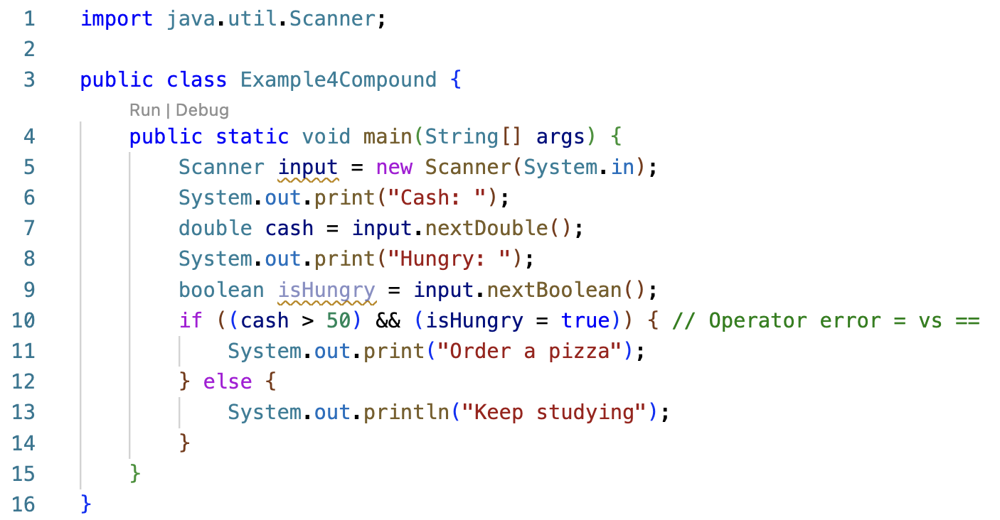
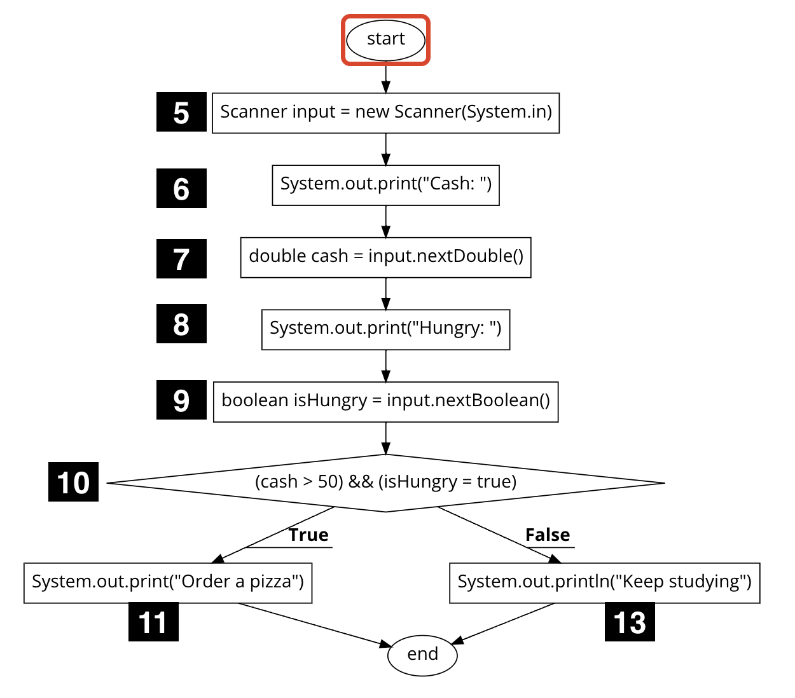

## Week 3 - Structural (clear-box) testing

Structural or clear-box testing techniques are based on code coverage, which measures the percent of code executed by the tests. Some basic measures of code coverage include:

- **Statement Coverage:** The percent of statements executed at least once.
- **Branch Coverage:** The percent of branches executed at least once. For example, `if (x  < 10)` requires at least 2 tests to cover both branches:
  - `x < 10` is true
  - `x < 10` is false
- **Condition/Predicate Coverage:** The percent of boolean sub-expression in a compound boolean expression that evaluate to `true` and `false` at least once. For example, the compound boolean expression `(isSunny || isWeekend)` requires 4 tests that evaluate as shown:

  | isSunny | isWeekend |
  | ------- | --------- |
  | true    | true      |
  | true    | false     |
  | false   | true      |
  | false   | false     |

- **Loop Coverage:** The percent of loops that have been executed at least zero times, one time, and two or more times.

The week#3 projects will be tested using structural testing techniques. Each test case will specify:

- the user input
- a column per decision point
- the expected output based on the requirements
- the actual output based on the program execution
- the execution path
- the test result of pass/fail

### Statement Coverage - BuggyExample1.java

Consider the following program that reads in two numbers and compares them to find the smallest. Line numbers are displayed to the left of each line of code. There is an error on line 14. The programmer copied the assignment statement from the `if` block (line 12) into the `else` block (line 14) and forgot to update the variable from `x` to `y`.

The runtime control flow can be visually depicted using a flowchart as shown below. Decision points are drawn as diamonds and all other statements are draw as rectangles. A line number is displayed next to each node. Line 6 is omitted since a variable declaration (without assignment) is a compile-time rather than runtime statement.

| Flowchart                                                                    | Simplified                                                                      |
| ---------------------------------------------------------------------------- | ------------------------------------------------------------------------------- |
|  |  |

The decision point at line 11 has two branches, which creates two execution paths. The line sequence 7, 8, 9, 10, 11 is denoted as 7-11:

| x <= y | path         |
| ------ | ------------ |
| true   | 7-11, 12, 16 |
| false  | 7-11, 14, 16 |

Assume the program is executed with the initial set of test cases shown below:

| Test | x <= y | Input   | Expected Output | Actual Output   | Path       | Status |
| ---- | ------ | ------- | --------------- | --------------- | ---------- | ------ |
| 1    | true   | 3 9     | smallest is 3   | smallest is 3   | 7-11,12,16 | Pass   |
| 2    | true   | 150 275 | smallest is 150 | smallest is 150 | 7-11,12,16 | Pass   |
| 3    | true   | 20 20   | smallest is 20  | smallest is 20  | 7-11,12,16 | Pass   |

All tests pass and the error on line 14 goes undetected.

**100% statement coverage** means every statement is executed by at least one test. The three test cases above **do not** achieve 100% statement coverage since line 14 is never executed.

100% statement coverage can be achieved by adding a fourth test such that `x <= y` is false, causing line 14 to execute.

| Test | x <= y | Input   | Expected Output | Actual Output   | Path       | Status |
| ---- | ------ | ------- | --------------- | --------------- | ---------- | ------ |
| 1    | true   | 3 9     | smallest is 3   | smallest is 3   | 7-11,12,16 | Pass   |
| 2    | true   | 150 275 | smallest is 150 | smallest is 150 | 7-11,12,16 | Pass   |
| 3    | true   | 20 20   | smallest is 20  | smallest is 20  | 7-11,12,16 | Pass   |
| 4    | false  | 25 10   | smallest is 10  | smallest is 25  | 7-11,14,16 | Fail   |

The fourth test case fails to produce the expected output, indicating an error exists in the code. The error was not discovered until 100% statement coverage was achieved.

### Branch Coverage - BuggyExample2.java

Consider the following program that reads in a number and prints whether it is even or not. The code contains an initialization error on line 9.

The program control flow is as shown:

| Flowchart                                                                     | Simplified                                                                      |
| ----------------------------------------------------------------------------- | ------------------------------------------------------------------------------- |
|  |  |

There are two possible execution paths:

| num % 2 == 0 | path         |
| ------------ | ------------ |
| true         | 6-10, 11, 12 |
| false        | 6-10, 12     |

Assume the program is executed with the following test case:

| Test | num % 2 == 0 | Input | Expected Output  | Actual Output    | Path       | Status |
| ---- | ------------ | ----- | ---------------- | ---------------- | ---------- | ------ |
| 1    | true         | 6     | 6 is even : true | 6 is even : true | 6-10,11,12 | Pass   |

The test passes and the initialization error on line 9 goes undetected.

Is 100% statement coverage achieved? Yes it is! The single test case causes every statement in the `main` method to execute. However, the error was not discovered because the `false` branch of the conditional statement is not executed.

**100% branch coverage** means every statement _and_ every branch is executed by at least one test. For each decision point (if, if-else, etc), at least one test includes a path that follows the `true` branch and at least one test includes a path that follows the `false` branch.

For the `BuggyExample2` class, 100% branch coverage is achieved by adding a second test to cover the `false` branch. We'll omit the path column and just list the branch for decision point `num % 2 == 0`.

| Test | num % 2 == 0 | Input | Expected Output   | Actual Output    | Path       | Status |
| ---- | ------------ | ----- | ----------------- | ---------------- | ---------- | ------ |
| 1    | true         | 6     | 6 is even : true  | 6 is even : true | 6-10,11,12 | Pass   |
| 2    | false        | 7     | 7 is even : false | 7 is even : true | 6-10, 12   | Fail   |

The second test case fails to produce the expected output, indicating an error exists in the code.

NOTE: 100% branch coverage implies 100% statement coverage, but not the other way around.

### Branch Coverage - Example3.java

Consider the following decision table that suggests a morning activity based on the day and outdoor temperature:

| isWeekend | temperature < 50 | activity         |
| --------- | ---------------- | ---------------- |
| true      | true             | Sleep late       |
| true      | false            | Sunrise at beach |
| false     |                  | Go to work       |

The `Example3` class implements the decision table using a nested conditional statement.

The program control flow is shown below.

The two decision points result in 3 possible paths:

| isWeekend | temperature < 50 | path     |
| --------- | ---------------- | -------- |
| true      | true             | 5-11, 12 |
| true      | false            | 5-11, 14 |
| false     |                  | 5-8, 17  |

For each decision point, there should be at least one test that attempts to cover the `true` branch and one that attempts to cover the `false` branch. We need a minimum of three tests to achieve 100% branch coverage for the two decision points based on the nested structure.

| Test | isWeekend | temperature < 50 | Input   | Expected Output  | Actual Output    | Path     | Status |
| ---- | --------- | ---------------- | ------- | ---------------- | ---------------- | -------- | ------ |
| 1    | true      | true             | true 45 | Sleep late       | Sleep late       | 5-11, 12 | Pass   |
| 2    | true      | false            | true 70 | Sunrise at beach | Sunrise at beach | 5-11, 14 | Pass   |
| 3    | false     |                  | false   | Go to work       | Go to work       | 5-8, 17  | Pass   |

### Condition/Predicate Coverage - Example4Compound.java

Consider the following decision table that suggests an activity based on the quantity of cash available and whether you are hungry:

| cash > 50 | isHungry | activity      |
| --------- | -------- | ------------- |
| true      | true     | Order a pizza |
| true      | false    | Keep studying |
| false     |          | Keep studying |

A compound boolean expression uses a logical (boolean) operator such as `&&`, `||`, `^`.

The `Example4Compound` class implements the decision table with a compound conditional that uses the logical `&&` (and) operator. Note there is an error on line 10 where `=` is used instead of `==`. The variable `isHungry` is assigned to the value `true`, overwriting the value input by the user.

The program control flow is shown below.

The one decision point results in 2 possible paths:

| (cash > 50) && (isHungry = true) | path     |
| -------------------------------- | -------- |
| true                             | 5-10, 11 |
| false                            | 5-10, 13 |

Is 100% branch coverage sufficient to find the error?

| Test | isWeekend | temperature < 50 | Input   | Expected Output  | Actual Output    | Path     | Status |
| ---- | --------- | ---------------- | ------- | ---------------- | ---------------- | -------- | ------ |
| 1    | true      | true             | true 45 | Sleep late       | Sleep late       | 5-11, 12 | Pass   |
| 2    | true      | false            | true 70 | Sunrise at beach | Sunrise at beach | 5-11, 14 | Pass   |
| 3    | false     |                  | false   | Go to work       | Go to work       | 5-8, 17  | Pass   |

## Resources

[https://app.code2flow.com/](https://app.code2flow.com/)
