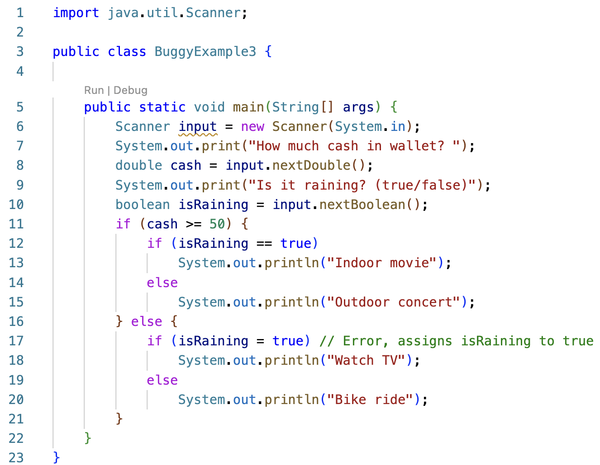
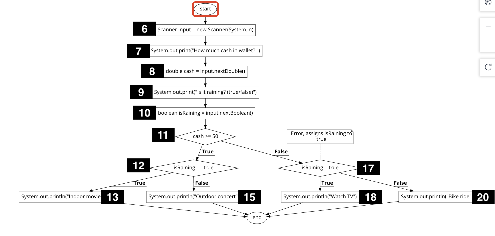

## Week 3 - White-box testing

White box testing techniques are based on code coverage, which measures the percent of code executed by the tests. Some basic measures of code coverage include:

- **Statement Coverage:** The percent of statements executed at least once.
- **Branch Coverage:** The percent of branches executed at least once. For example, `if (x  < 10)` requires at least 2 tests to cover both branches:
  - `x < 10` is true
  - `x < 10` is false
- **Condition/Predicate Coverage:** The percent of boolean sub-expression in a compound boolean expression that evaluate to `true` and `false` at least once. For example, the compound boolean expression `(isSunny || isWeekend)` requires 4 tests that evaluate as shown:

  | isSunny | isWeekend |
  | ------- | --------- |
  | true    | true      |
  | true    | false     |
  | false   | true      |
  | false   | false     |

- **Loop Coverage:** The percent of loops that have been executed at least zero times, one time, and two or more times.

### Statement Coverage - BuggyExample1.java

Consider the following program that reads in two numbers and compares them to find the smallest. Line numbers are displayed to the left of each line of code. The programmer copied the assignment statement from the `if` block (line 12) into the `else` block (line 14) and forgot to update the variable from `x` to `y`.

The program control flow can be visually depicted using a flowchart as shown below. We will use a simplified flowchart notation, drawing decision points as diamonds and all other statements as a rectangle. The line number is displayed next to each node in the graph. Note that line 6 is omitted since a variable declaration (without assignment) is a compile-time rather than runtime statement.

| Flowchart                                                                    | Simplified                                                                      |
| ---------------------------------------------------------------------------- | ------------------------------------------------------------------------------- |
|  |  |

There are two possible execution paths due to the two branches of the conditional statement at line 11. The line sequence 7, 8, 9, 10, 11 is denoted as 7-11:

| x <= y | path         |
| ------ | ------------ |
| true   | 7-11, 12, 16 |
| false  | 7-11, 14, 16 |

Assume the program is executed with the initial set of test cases shown below:

| Test | Input   | Expected Output | Actual Output   | Path       | Pass/Fail |
| ---- | ------- | --------------- | --------------- | ---------- | --------- |
| 1    | 3 9     | smallest is 3   | smallest is 3   | 7-11,12,16 | Pass      |
| 2    | 150 275 | smallest is 150 | smallest is 150 | 7-11,12,16 | Pass      |
| 3    | 20 20   | smallest is 20  | smallest is 20  | 7-11,12,16 | Pass      |

All tests pass and the error on line 14 goes undetected.

**100% statement coverage** means every statement is executed by at least one test. The three test cases above **do not** achieve 100% statement coverage since line 14 is never executed.

100% statement coverage can be achieved by adding a fourth test such that `x <= y` is false, causing line 14 to be executed.

| Test | Input   | Expected Output | Actual Output   | Path       | Pass/Fail |
| ---- | ------- | --------------- | --------------- | ---------- | --------- |
| 1    | 3 9     | smallest is 3   | smallest is 3   | 7-11,12,16 | Pass      |
| 2    | 150 275 | smallest is 150 | smallest is 150 | 7-11,12,16 | Pass      |
| 3    | 20 20   | smallest is 20  | smallest is 20  | 7-11,12,16 | Pass      |
| 4    | 25 10   | smallest is 10  | smallest is 25  | 7-11,14,16 | Fail      |

The fourth test case fails to produce the expected output, indicating an error exists in the code. The error was not discovered until 100% statement coverage was achieved.

### Branch Coverage - BuggyExample2.java

Consider the following program that reads in a number and prints whether it is even or not. The code contains an initialization error on line 9.

The program control flow is as shown:

| Flowchart                                                                     | Simplified                                                                      |
| ----------------------------------------------------------------------------- | ------------------------------------------------------------------------------- |
|  |  |

There are two possible execution paths:

| num % 2 == 0 | path         |
| ------------ | ------------ |
| true         | 6-10, 11, 12 |
| false        | 6-10, 12     |

Assume the program is executed with the following test case:

| Test | Input | Expected Output  | Actual Output    | Path       | Pass/Fail |
| ---- | ----- | ---------------- | ---------------- | ---------- | --------- |
| 1    | 6     | 6 is even : true | 6 is even : true | 6-10,11,12 | Pass      |

The test passes and the initialization error on line 9 goes undetected.

Is 100% statement coverage achieved? Yes it is! The single test case causes every statement in the `main` method to execute. However, the error was not discovered because the `false` branch of the conditional statement is not executed.

**100% branch coverage** means every statement and every branch is executed by at least one test. For each decision point (if, if-else, etc), at least one test includes a path that follows the `true` branch and at least one test includes a path that follows the `false` branch.

For the `BuggyExample2` class, 100% branch coverage is achieved by adding a second test to cover the `false` branch.

| Test | Input | Expected Output   | Actual Output    | num % 2 == 0 | Pass/Fail |
| ---- | ----- | ----------------- | ---------------- | ------------ | --------- |
| 1    | 6     | 6 is even : true  | 6 is even : true | true         | Pass      |
| 2    | 7     | 7 is even : false | 7 is even : true | false        | Fail      |

Each test case omits the path and instead displays the branch followed for the decision point `num % 2 == 0`. The second test case fails to produce the expected output, indicating an error exists in the code.

NOTE: 100% branch coverage implies 100% statement coverage, but not the other way around.

### Branch Coverage - BuggyExample3.java

Consider the following decision table that suggests an activity based on the amount of available cash and whether or not it is raining:

|                           | cash >= 50      | cash < 50 |
| ------------------------- | --------------- | --------- |
| <b>isRaining == true</b>  | Indoor Movie    | Watch TV  |
| <b>isRaining == false</b> | Outdoor Concert | Ride Bike |

The `BuggyExample3` class attempts to implement the decision table using nested conditional statements. However, there is an error on line 17:

- The assignment operator `=` is used instead of the equality operator `==`.
- Line 17 assigns `isRaining` to `true`, which causes the `true` branch to line 18 to execute. The `else` branch and line 20 are never executed, regardless of the input.

The program control flow is shown below.

There are four paths through the flowchart, although the last path not achievable due to the logic error:

| cash >= 50 | isRaining | path             |
| ---------- | --------- | ---------------- |
| true       | true      | 6-11, 12, 13     |
| true       | false     | 6-11, 12, 15     |
| false      | true      | 6-11, 16, 17, 18 |
| false      | false     | 6-11, 16, 17, 20 |

For each decision point, there should be at least one test that **attempts** to cover the `true` branch and one that **attempts** to cover the `false` branch. The program logic may prevent execution of a particular branch, as is the case for test #4.

| Test | Input    | Expected Output | Actual Output   | cash >= 50 | isRaining | Pass/Fail |
| ---- | -------- | --------------- | --------------- | ---------- | --------- | --------- |
| 1    | 60 true  | Indoor Movie    | Indoor Movie    | true       | true      | Pass      |
| 2    | 50 false | Outdoor Concert | Outdoor Concert | true       | false     | Pass      |
| 3    | 49 true  | Watch TV        | Watch TV        | false      | true      | Pass      |
| 4    | 30 false | Ride Bike       | Watch TV        | false      | false     | Fail      |

NOTE: `BuggyExamle3.java` demonstrates a very common error, namely using `=` rather than `==` within a boolean expression. The error can be avoided by omitting the equality operator:

| Bad Style               | Better Style    |
| ----------------------- | --------------- |
| if (isRaining == true)  | if (isRaining)  |
| if (isRaining == false) | if (!isRaining) |

## Resources

[https://app.code2flow.com/](https://app.code2flow.com/)
