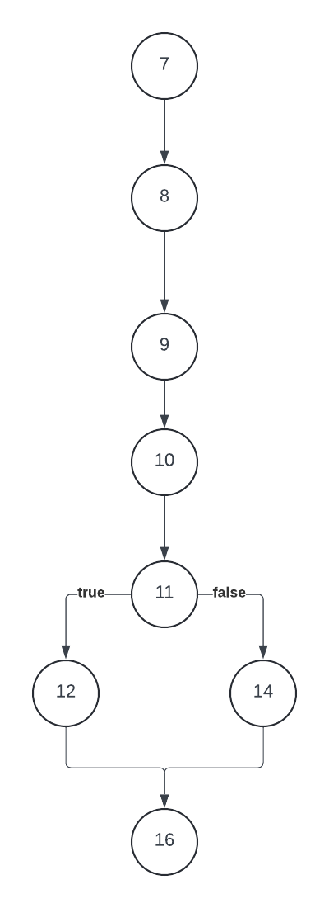
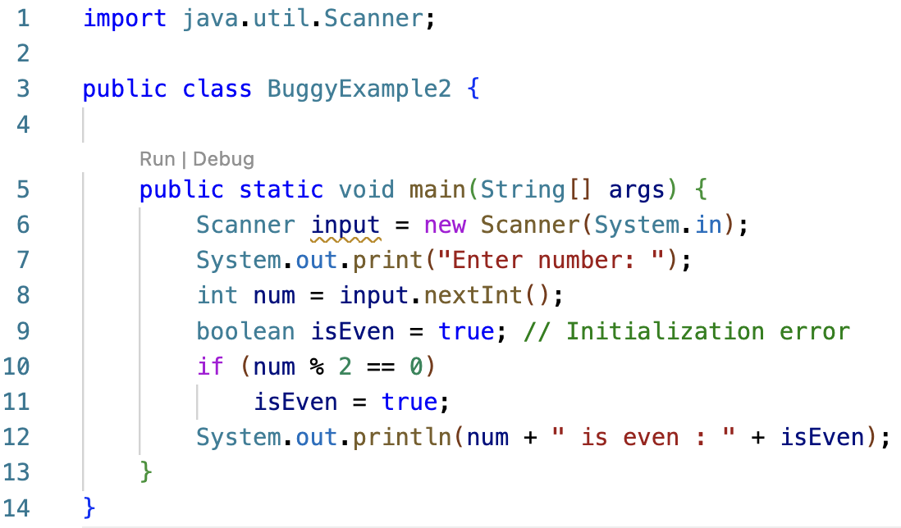
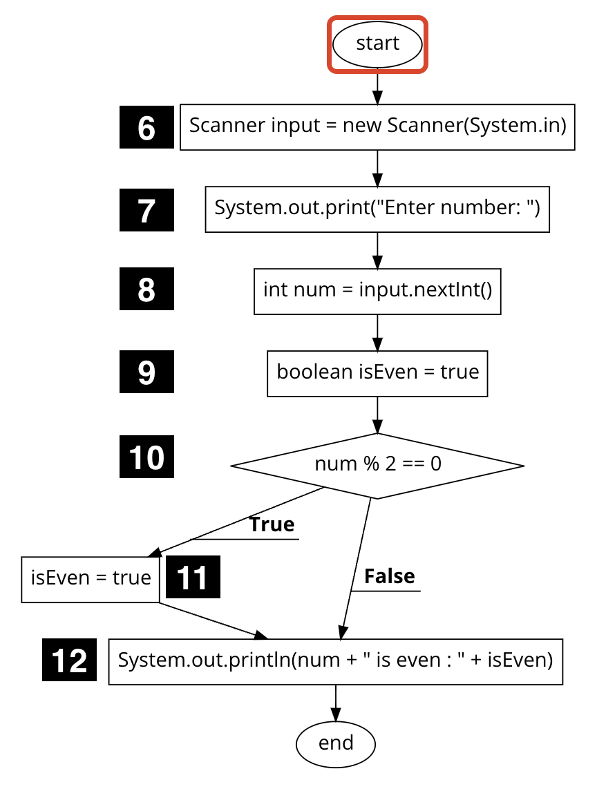
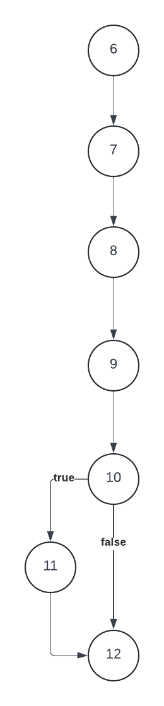
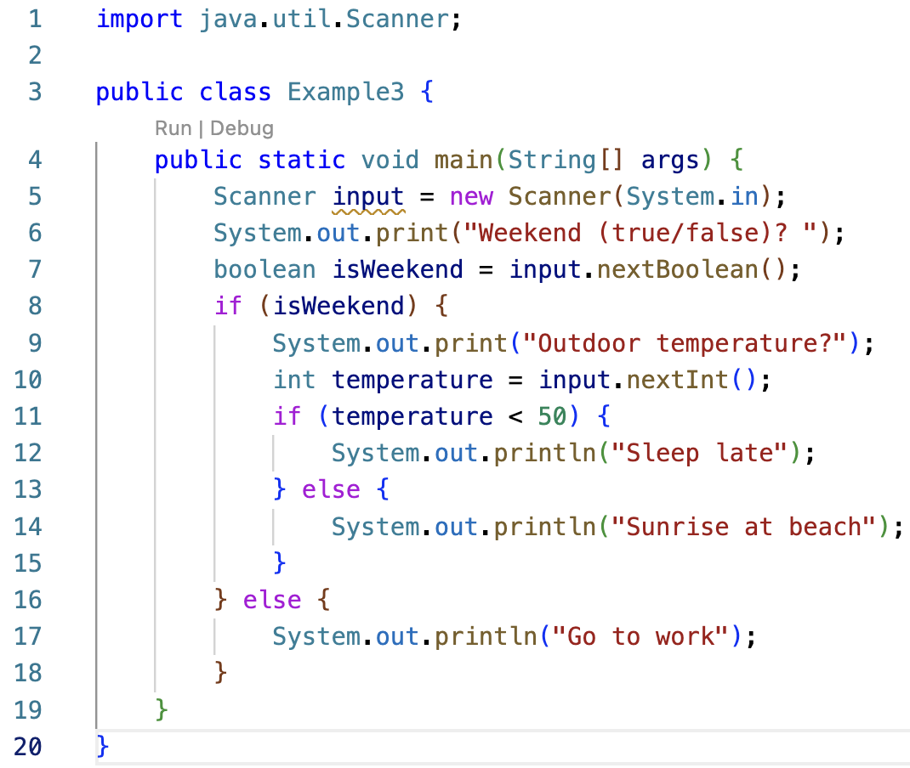
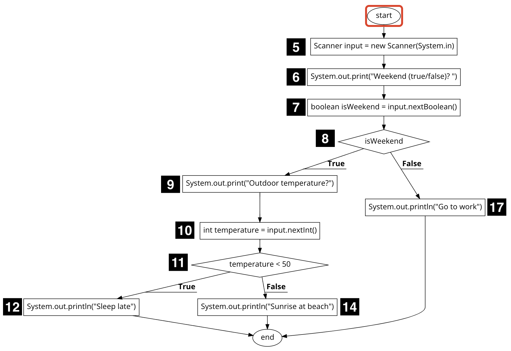
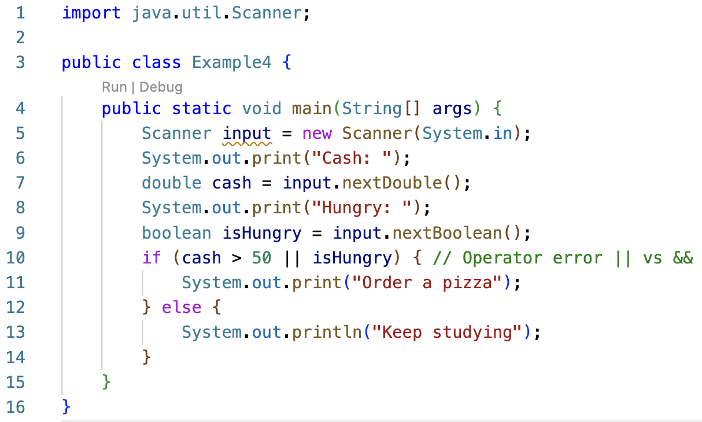
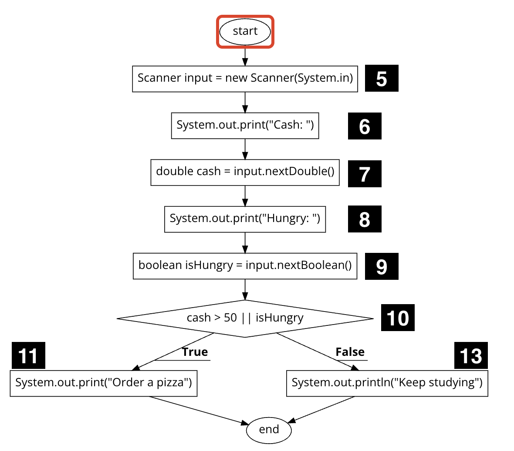
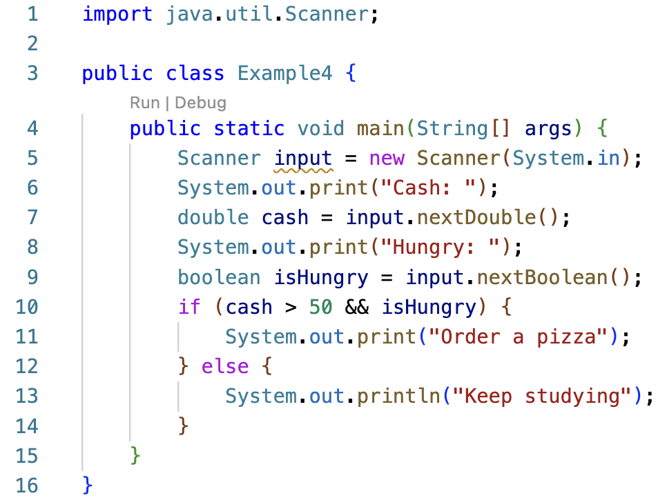

## Week 3 - Structural (clear-box) testing

Structural or clear-box testing techniques are based on code coverage, which measures the percent of code executed by the tests. Some basic code coverage criteria include:

- **Statement Coverage:** Every statement is executed at least once.
- **Decision Coverage:** Every decision results in a true outcome and a false outcome at least once. For example, the decision `if (isSunny && isWeekend)` requires two test cases: one for a true outcome and another for a false outcome.
- **Condition Coverage:** Every condition in a decision results in a true outcome and a false outcome at least once. The decision `if (isSunny && isWeekend)` consists of a compound boolean expression with two conditions: (1) `isSunny` and (2) `isWeekend`. Each must have both a true outcome and a false outcome.
- **Loop Coverage:** Each loop is executed zero, one, and two or more times.

### Statement Coverage - BuggyExample1.java

Consider the following program that reads in two numbers and compares them to find the smallest. Line numbers are displayed to the left of each line of code. There is an error on line 14. The programmer copied the assignment statement from the `if` block (line 12) into the `else` block (line 14) and forgot to update the variable from `x` to `y`.

The program control flow can be visually depicted using a flowchart as shown on the left below. Decision points are drawn as diamonds and all other statements are drawn as rectangles. A line number is displayed next to each statement. Line 6 is omitted since a variable declaration without assignment is a compile-time rather than runtime statement. The flowchart is further simplified on the right to show only the line numbers.

| Program Control Flow                                                                    | Simplified                                                                                  |
| --------------------------------------------------------------------------------------- | ------------------------------------------------------------------------------------------- |
|  |  |

The decision point at line 11 has two branches, which creates two execution paths. The line sequence 7, 8, 9, 10, 11 is denoted as 7-11:

| x <= y | path         |
| ------ | ------------ |
| true   | 7-11, 12, 16 |
| false  | 7-11, 14, 16 |

Assume the program is executed with the initial set of test cases shown below:

| Test | Input   | Expected Output | Actual Output   | Path       | Status |
| ---- | ------- | --------------- | --------------- | ---------- | ------ |
| 1    | 3 9     | smallest is 3   | smallest is 3   | 7-11,12,16 | Pass   |
| 2    | 150 275 | smallest is 150 | smallest is 150 | 7-11,12,16 | Pass   |
| 3    | 20 20   | smallest is 20  | smallest is 20  | 7-11,12,16 | Pass   |

All tests pass and the error on line 14 goes undetected.

**100% statement coverage** means every statement is executed by at least one test. The three test cases above **do not** achieve 100% statement coverage since line 14 is never executed.

100% statement coverage can be achieved by adding a fourth test such that `x <= y` is false, causing line 14 to execute.

| Test | Input   | Expected Output | Actual Output   | Path       | Status |
| ---- | ------- | --------------- | --------------- | ---------- | ------ |
| 1    | 3 9     | smallest is 3   | smallest is 3   | 7-11,12,16 | Pass   |
| 2    | 150 275 | smallest is 150 | smallest is 150 | 7-11,12,16 | Pass   |
| 3    | 20 20   | smallest is 20  | smallest is 20  | 7-11,12,16 | Pass   |
| 4    | 25 10   | smallest is 10  | smallest is 25  | 7-11,14,16 | Fail   |

The fourth test case fails to produce the expected output.

_It's crucial to recognize that the purpose of testing isn't to confirm that the code works, but to find errors. In this case, the fourth test successfully identifies the presence of an error._

### Decision Coverage - BuggyExample2.java

Consider the `BuggyExample2` class, which reads a number from input and prints whether it is even. The code contains an initialization error on line 9.

The program control flow is as shown:

| Program Control Flow                                                                     | Simplified                                                                                  |
| ---------------------------------------------------------------------------------------- | ------------------------------------------------------------------------------------------- |
|  |  |

The decision point `if (num % 2 == 0)` results in two execution paths:

| num % 2 == 0 | path         |
| ------------ | ------------ |
| true         | 6-10, 11, 12 |
| false        | 6-10, 12     |

Assume the program is executed with the following test case:

| Test | Input | Expected Output  | Actual Output    | Path       | Status |
| ---- | ----- | ---------------- | ---------------- | ---------- | ------ |
| 1    | 6     | 6 is even : true | 6 is even : true | 6-10,11,12 | Pass   |

The test passes and the initialization error on line 9 goes undetected.

Is 100% statement coverage achieved? Yes it is! The test case causes every statement in the `main` method to execute. However, the error was not discovered because the `false` branch of the conditional statement is not executed.

**100% decision coverage** requires one test to evaluate `num % 2 == 0` as `true` and another test as `false`. For the `BuggyExample2` class, 100% decision coverage is achieved by adding a second test to cover the `false` branch.

| Test | Input | Expected Output   | Actual Output    | Path       | num % 2 == 0 | Status |
| ---- | ----- | ----------------- | ---------------- | ---------- | ------------ | ------ |
| 1    | 6     | 6 is even : true  | 6 is even : true | 6-10,11,12 | true         | Pass   |
| 2    | 7     | 7 is even : false | 7 is even : true | 6-10, 12   | false        | Fail   |

The second test case fails to produce the expected output, indicating an error exists in the code.

### Decision Coverage - Example3.java

Here’s a decision table that recommends a morning activity based on the day of the week and the outdoor temperature.

| isWeekend | temperature < 50 | activity         |
| --------- | ---------------- | ---------------- |
| true      | true             | Sleep late       |
| true      | false            | Sunrise at beach |
| false     | true             | Go to work       |
| false     | false            | Go to work       |

The `Example3` class implements the decision table using a nested conditional statement.

The program control flow is shown below.

The two decision points result in 3 possible paths:

| isWeekend | temperature < 50 | path     |
| --------- | ---------------- | -------- |
| true      | true             | 5-11, 12 |
| true      | false            | 5-11, 14 |
| false     |                  | 5-8, 17  |

For each decision, there should be at least one test that covers the `true` branch and one that covers the `false` branch. Three tests are required to achieve 100% decision coverage for the nested structure:

| Test | Input   | Expected Output  | Actual Output    | Path     | isWeekend | temperature < 50 | Status |
| ---- | ------- | ---------------- | ---------------- | -------- | --------- | ---------------- | ------ |
| 1    | true 45 | Sleep late       | Sleep late       | 5-11, 12 | true      | true             | Pass   |
| 2    | true 70 | Sunrise at beach | Sunrise at beach | 5-11, 14 | true      | false            | Pass   |
| 3    | false   | Go to work       | Go to work       | 5-8, 17  | false     |                  | Pass   |

### Logical operator short-circuiting

Before discussing condition coverage, let's review how Java processes a logical expression.

Java short-circuits the evaluation of a compound logical expression such as `a || b` or `a && b`, meaning the second condition `b` isn't evaluated if the result is clear after evaluating the first condition `a`. This is done for efficiency to avoid unnecessary computation.

| a     | b     | a \|\| b                      | a && b                         |
| ----- | ----- | ----------------------------- | ------------------------------ |
| true  | true  | true  <i>short circuit</i> | true   &nbsp;               |
| true  | false | true  <i>short circuit</i> | false   &nbsp;              |
| false | true  | true   &nbsp;              | false  <i>short circuit</i> |
| false | false | false   &nbsp;             | false  <i>short circuit</i> |

Given the logical expression `a  || b `:

- If `a ` is `true`, then Java short-circuits and returns `true` **without evaluating** `b `.
- If `a ` is `false`, then `b ` is evaluated and the result is returned.

Similarly, given `a  && b `:

- If `a ` is `false`, then Java short-circuits and returns `false` **without evaluating** `b `.
- If `a` is `true`, then `b` is evaluated and the result is returned.

Notice that `a || b` and `a && b` produce the same value when the conditions are either both true (first row) or both false (fourth row). As we will illustrate in the next example, 100% branch coverage may not be adequate for detecting errors in logical operators.

### Condition Coverage - Example4.java

Here’s a decision table that recommends an activity based on two conditions: cash and hunger.

| cash > 50 | isHungry | activity      |
| --------- | -------- | ------------- |
| true      | true     | Order a pizza |
| true      | false    | Keep studying |
| false     | true     | Keep studying |
| false     | false    | Keep studying |

The `Example4` class attempts to implement the decision table. Note there is an error on line 10 where the logical OR operator `||` is used instead of the AND operator `&&`.

The program control flow is shown below.

The decision point has two branches, resulting in two paths:

| cash > 50 \|\| isHungry | path     |
| ----------------------- | -------- |
| true                    | 5-10, 11 |
| false                   | 5-10, 13 |

The two tests below achieve 100% decision coverage as indicated in the `cash > 50 || isHungry` column, yet the operator error on line 10 goes undetected. **100% condition coverage** means every condition evaluates to both `true` and `false` at least once. Although the input values for the two tests appear to meet this requirement, test #1 short-circuits since `cash > 50` is true. Consequently, the condition `isHungry` is never assessed as true.

| Test | Input    | Expected Output | Actual Output | cash > 50 \|\| isHungry | cash > 50 | isHungry | Status |
| ---- | -------- | --------------- | ------------- | ----------------------- | --------- | -------- | ------ |
| 1    | 60 true  | Order a pizza   | Order a pizza | true                    | true      |          | Pass   |
| 2    | 40 false | Keep studying   | Keep studying | false                   | false     | false    | Pass   |

To achieve 100% condition coverage, we'll need to add a third test that avoids a short-circuit by evaluating `cash > 50` as false:

| Test | Input    | Expected Output | Actual Output | cash > 50 \|\| isHungry | cash > 50 | isHungry | Status |
| ---- | -------- | --------------- | ------------- | ----------------------- | --------- | -------- | ------ |
| 1    | 60 true  | Order a pizza   | Order a pizza | true                    | true      |          | Pass   |
| 2    | 40 false | Keep studying   | Keep studying | false                   | false     | false    | Pass   |
| 3    | 35 true  | Keep studying   | Order a pizza | true                    | false     | true     | Fail   |

The third test indicates an error exists in the code. Assume line 10 is corrected to use the logical operator `&&`:

Since the code has been modified, the tests should be re-executed. Tests #2 and #3 now short-circuit due to the `&&` operator. The tests do not achieve 100% condition coverage as `isHungry` is never evaluated as false.

| Test | Input    | Expected Output | Actual Output | cash > 50 && isHungry | cash > 50 | isHungry | Status |
| ---- | -------- | --------------- | ------------- | --------------------- | --------- | -------- | ------ |
| 1    | 60 true  | Order a pizza   | Order a pizza | true                  | true      | true     | Pass   |
| 2    | 40 false | Keep studying   | Keep studying | false                 | false     |          | Pass   |
| 3    | 35 true  | Keep studying   | Keep studying | false                 | false     |          | Pass   |

We'll introduce a fourth test as shown below where `cash > 50` is true to prevent the short-circuit and attain 100% condition coverage. Keep in mind that only one of either test #2 or #3 is required for complete condition coverage given the logical operator `&&`.

| Test | Input    | Expected Output | Actual Output | cash > 50 && isHungry | cash > 50 | isHungry | Status |
| ---- | -------- | --------------- | ------------- | --------------------- | --------- | -------- | ------ |
| 1    | 60 true  | Order a pizza   | Order a pizza | true                  | true      | true     | Pass   |
| 2    | 40 false | Keep studying   | Keep studying | false                 | false     |          | Pass   |
| 3    | 35 true  | Keep studying   | Keep studying | false                 | false     |          | Pass   |
| 4    | 55 false | Keep studying   | Keep studying | false                 | true      | false    | Pass   |

### Code Coverage Tools

The examples presented in this lesson are small enough that it is easy to identify the execution paths and determine code coverage, but most programs are too large and complex to do this manually.
[https://github.com/jacoco/jacoco](Jacoco) is a popular code coverage report generator for Java projects that can be used with many IDEs. Tools like Jacoco are often integrated with unit testing frameworks like [https://junit.org/junit5/](Junit).

## Conclusion

Functional (opaque-box) testing checks the application against a set of requirements, while structural (clear-box) testing is based on code coverage and measures the percent of code executed by the tests. In this lesson, we looked at three measures of code coverage: statement, decision, and condition. Statement coverage is considered a very weak and inadequate level of testing. The goal during testing is to strive for decision coverage, or even better condition coverage.

Decision coverage requires 2 tests for `if (a)`:

| Test | a     |
| ---- | ----- |
| 1    | true  |
| 2    | false |

Condition coverage requires 3 tests for a compound decision with one operator `if (a && b)`:

| Testing && | a     | b             |
| ---------- | ----- | ------------- |
| 1          | false | short-circuit |
| 2          | true  | true          |
| 3          | true  | false         |

Condition coverage for `if (a || b)` also requires 3 tests:

| Testing \|\| | a     | b             |
| ------------ | ----- | ------------- |
| 1            | true  | short-circuit |
| 2            | false | true          |
| 3            | false | false         |

It's crucial to recognize that code coverage does not guarantee effective testing; it merely indicates the extent of code that has been executed by the tests.

## Resources

Java files for this lesson are available at [https://github.com/linda-seiter/cmsc115_2252](https://github.com/linda-seiter/cmsc115_2252)

[https://app.code2flow.com/](https://app.code2flow.com/)

[https://github.com/jacoco/jacoco](https://github.com/jacoco/jacoco)

[https://junit.org/junit5/](https://junit.org/junit5/)

<!--

>
