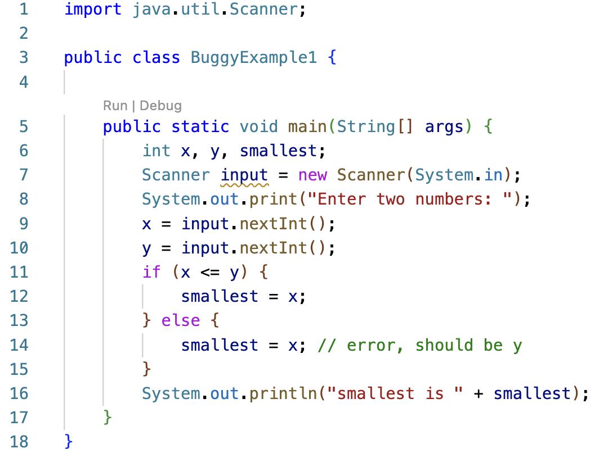

## Week 3 - White-box testing

White box testing techniques are based on code coverage and measure how much code is executed by the tests. Some basic measures of code coverage include:

- **Statement Coverage:** The percent of statements executed at least once.
- **Branch Coverage:** The percent of branches or decision points executed at least once.
  - The conditional statement `if (x  < 10)` requires at least 2 tests (`x < 10` is true, `x < 10` is false).
- **Condition/Predicate Coverage:** The percent of boolean sub-expression in a compound boolean expression that evaluate to `true` and `false` at least once.
  - The compound boolean expression `(isSunny || isWeekend)` requires 4 tests that evaluate as shown:
    - `(true || true)`
    - `(true || false)`
    - `(false || true)`
    - `(false || false)`
- **Loop Coverage:** The percent of loops that have been executed at least zero times, one time, and two or more times.

### Statement Coverage - BuggyExample1.java

Consider the following program that reads in two numbers and compares them to find the smallest. The programmer copied the assignment statement from the if block (line 12) into the else block (line 14) and forgot to update the variable from `x` to `y`. Thus, there is an error in the else branch.

Assume the program is executed with the initial set of test cases shown below. Note there is an additional column listing the lines of code executed by the test. Line 6 is not included as a variable declaration (without assignment) is not considered an executable statement.

| Test | Input   | Expected Output | Actual Output   | Path              | Pass/Fail |
| ---- | ------- | --------------- | --------------- | ----------------- | --------- |
| 1    | 3 9     | smallest is 3   | smallest is 3   | 7,8,9,10,11,12,16 | Pass      |
| 2    | 150 275 | smallest is 150 | smallest is 150 | 7,8,9,10,11,12,16 | Pass      |
| 3    | 20 20   | smallest is 20  | smallest is 20  | 7,8,9,10,11,12,16 | Pass      |

All tests pass and the error on line 14 goes undetected.

**100% statement coverage** means every executable line of code is executed by at least one test.
The three test cases above **do not** achieve 100% statement coverage since line 14 is never executed.

- We'll add a fourth test case to cause the condition `x <= y` to be false to execute the `else` branch containing line 14.
- The fourth test case fails to produce the expected output, which indicates there is an error in the code.

| Test | Input   | Expected Output | Actual Output   | Path              | Pass/Fail |
| ---- | ------- | --------------- | --------------- | ----------------- | --------- |
| 1    | 3 9     | smallest is 3   | smallest is 3   | 7,8,9,10,11,12,16 | Pass      |
| 2    | 150 275 | smallest is 150 | smallest is 150 | 7,8,9,10,11,12,16 | Pass      |
| 3    | 20 20   | smallest is 20  | smallest is 20  | 7,8,9,10,11,12,16 | Pass      |
| 4    | 25 10   | smallest is 10  | smallest is 25  | 7,8,9,10,11,14,16 | Fail      |

The four test cases achieve 100% statement coverage.

